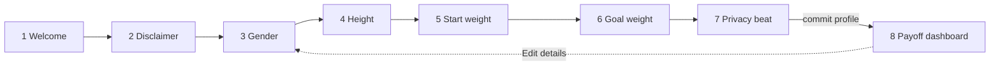

# Daybreak — Onboarding Flow Specification

> **Status:** implementation blueprint. This document is precise enough to code
> against. It replaces the current single-card `ProfileForm` (`src/components/ProfileForm.tsx`)
> with a multi-step, conversational "Dawn" flow.
>
> **Grounding:** competitive analysis in `docs/onboarding-inspiration.md`; clinical
> figures in `docs/glp1-research.md`; visual language in `frontend/CLAUDE.md`
> ("Dawn / New Horizon"); reference screens in `docs/references/onboarding/`.
>
> **Product guardrail (non-negotiable):** Daybreak gives **information, never
> medical or dosing advice**. Every projection is a rough range carrying the
> "individual results vary — not medical advice" caveat (`.caveat`).
>
> **Canonical-units invariant (from CLAUDE.md / `src/db/db.ts`):** store weight in
> **kg**, height in **cm**, timestamps in **epoch-ms**. Display units (lb, ft/in)
> are a presentation concern only — convert at the display edge, never in storage.

---

## 1. Flow overview

One question per screen, a progress rail on the questionnaire steps, a warm value
beat at the start and a payoff at the end. Eight steps:

| # | Screen | One-line purpose |
|---|--------|------------------|
| 1 | **Welcome** | Lead with value and warmth; ask for nothing yet. |
| 2 | **Health disclaimer** | Honour the guardrail: information, not medical advice. Gated consent toggle. |
| 3 | **Gender** | Tap-card single choice for body-composition context. |
| 4 | **Height** | Wheel picker with cm ↔ ft/in display toggle. |
| 5 | **Starting weight** | Wheel picker with kg ↔ lb toggle; dignified framing. |
| 6 | **Goal weight** | Wheel picker with kg ↔ lb toggle; aspirational framing. |
| 7 | **Privacy beat** | Elevate "everything stays on this device" to its own reassuring screen; commits the profile. |
| 8 | **Payoff reveal** | The dashboard: BMI start→target + journey rail **plus** a time-to-target projection range from SURMOUNT data, with caveat. |



**Tone pillars:** Atoms' dignified identity voice, Clue's privacy candour,
MacroFactor's gated-disclaimer rigour, MyFitnessPal's projection payoff, Flo's
reassurance cadence.

**Global chrome (already present in `App.tsx`):** every screen renders inside
`Shell` — `.app-shell` background, floating `.sun-glow animate-float`, centered
`.app-main` (`max-w-xl`), the `Daybreak` `.wordmark` header, and a per-screen
`animate-fade-rise` entrance keyed on the screen name. The onboarding flow lives
inside `Shell`'s `<main>`; keying the entrance on the **step index** gives each
step its gentle fade-rise on advance and on back.

---

## 2. Per-step detailed spec

### Shared scaffold: `StepShell`

Every questionnaire step (2–7) is wrapped in a `StepShell` so chrome stays
consistent and the steps themselves are pure content:

- **Container:** `.card` (`rounded-3xl`, cream, `shadow-card`, `p-6 sm:p-8`).
- **Top row:** a **back affordance** on the left (`.btn-ghost`, compact, label
  "Back", `aria-label="Go back"`), hidden on the first interactive step where back
  is not available; and the **progress rail** on the right / full width below it.
- **Progress rail:** reuse the journey primitive — `.journey-track` with a
  `.journey-fill` whose inline `width` = `progress * 100%`. `role="progressbar"`,
  `aria-valuemin={0}`, `aria-valuemax={100}`, `aria-valuenow={Math.round(progress*100)}`,
  `aria-label="Onboarding progress"`. `progress` is supplied by the flow controller
  (see §5); Welcome shows no rail, payoff shows none.
- **Heading block:** `.hero-eyebrow` (eyebrow), `.hero-title` (headline,
  `mt-2`), `.hero-sub` (subtitle). Left-aligned.
- **Body slot:** the step's input(s), with `mt-8` rhythm.
- **Footer:** a single primary action, full width (`w-full mt-7`). Use
  `.btn-primary` for forward motion and `.btn-accent` only for the two joyful
  moments (Welcome's "Let's begin" and Privacy's "See my journey").
- **Motion:** the active step mounts with `animate-fade-rise`. No bespoke
  animation — the reduced-motion media block in `index.css` neutralises tokens
  automatically.

> Welcome (1) and Payoff (8) do **not** use `StepShell`'s progress rail/back row —
> see their entries.

---

### Step 1: Welcome

- **Purpose:** value statement and emotional invitation. No input.
- **Layout:** `.card`. No progress rail, no back. Centered decorative warmth from
  the existing `.sun-glow animate-float` (already in `Shell`). Heading block
  left-aligned; single CTA full width.
- **Copy:**
  - Eyebrow (`.hero-eyebrow`): `Welcome to Daybreak`
  - Headline (`.hero-title`): `Your brighter chapter starts here`
  - Subtitle (`.hero-sub`): `Daybreak walks beside you on your tirzepatide journey — tracking where you started, how far you've come, and the bright place you're headed. No accounts, no servers. Just your progress, on your terms.`
  - Primary CTA (`.btn-accent w-full mt-7`): `Let's begin`
  - Footnote (`.footnote mt-4 text-center`): `Takes about a minute. You can change anything later.`
- **Inputs:** none.
- **Data flow:** none persisted. Pressing the CTA initialises the in-memory draft
  (see §4/§5) if it does not exist and advances to step 2.
- **Navigation:** no back (first screen). Cannot be skipped (it is the entry). No
  progress rail.
- **Interaction:** entrance `animate-fade-rise`. The CTA may carry
  `animate-glow-pulse` (the one breathing CTA on the screen) — it is the single
  most joyful action here.
- **Accessibility:** `<h1>` is the headline. CTA is a real `<button>`. Focus moves
  to the headline (or the CTA) on mount; `tabIndex={-1}` on the `<h1>` if you
  choose to focus it for screen-reader context.

---

### Step 2: Health disclaimer

Pattern source: MacroFactor "Notice / Health Disclaimer" with **gated** toggle
(`docs/references/onboarding/macrofactor/01-health-disclaimer.webp`). This step
enforces the product guardrail and must be passed deliberately.

- **Purpose:** make explicit that Daybreak is informational, not medical advice;
  capture consent.
- **Layout:** `StepShell`. Progress rail present (first questionnaire step). Back
  is available (returns to Welcome). Disclaimer body sits in a `.card-quiet` inset
  panel (flatten hierarchy — no card-in-card visual noise). The consent control is
  a single row below it.
- **Copy:**
  - Eyebrow: `Before we begin`
  - Headline: `A quick, honest note`
  - Body (inside `.card-quiet`, `text-ink-soft text-sm leading-relaxed`):
    `Daybreak is an informational companion for tracking your own journey. It shares general information drawn from published research — it is not medical or dosing advice, and it can't diagnose, prescribe, or tell you how to use any medication. For anything about your treatment, your healthcare provider is your guide.`
  - Consent label (next to the toggle): `I understand that Daybreak provides information, not medical advice.`
  - Primary CTA (`.btn-primary w-full`): `Continue`
- **Inputs:**
  - Field: `disclaimerAccepted` (boolean, local). Rendered as an **accessible
    switch**: a `<button role="switch" aria-checked={accepted}>` styled with
    tokens — track `bg-cream-200` → `bg-primary-500` when on, knob `bg-cream-50`,
    `rounded-full`, `transition` (token-covered). Equivalent acceptable rendering:
    a visually-replaced native `<input type="checkbox">` inside a `.card-quiet`
    row with a primary-500 check. Default: **off**.
  - Validation: the Continue button is **disabled** (`disabled` + `aria-disabled`)
    until `disclaimerAccepted === true`. This is the gate; it cannot be bypassed.
- **Data flow:** on toggle **on**, set `draft.disclaimerAcceptedAt = Date.now()`
  (truthful timestamp of the moment of consent); on toggle off, clear it. The
  value is written to the persisted `Profile` only at the commit in step 7.
- **Navigation:** back → Welcome. **Cannot be skipped.** Progress rail advances.
- **Interaction:** toggling on enables the CTA with a gentle state change (token
  transition). No animation beyond the step entrance.
- **Accessibility:** the switch has an associated visible label (`<label>` linked
  by `htmlFor`/`id`, or `aria-labelledby` pointing at the consent text). Keyboard:
  `Space`/`Enter` toggles the switch; `Tab` reaches it before the CTA. The disabled
  CTA must be reachable by screen readers with its disabled state announced.

---

### Step 3: Gender

Pattern source: MacroFactor goal cards
(`docs/references/onboarding/macrofactor/02-goal-selection.webp`) — large
tappable cards, one decision per screen.

- **Purpose:** capture biological sex for body-composition context.
- **Layout:** `StepShell`. Two stacked choice cards (`flex flex-col gap-3`), each a
  `.card-quiet` styled as a tappable option. Selected card gets
  `ring-2 ring-primary-200 shadow-glow-primary` and a small primary check glyph
  (`text-primary-500`).
- **Copy:**
  - Eyebrow: `About you`
  - Headline: `Which best describes you?`
  - Subtitle: `This helps us frame body-composition context. It won't change your BMI category — those are the same for everyone.`
  - Card A label: `Female`
  - Card B label: `Male`
  - Primary CTA (`.btn-primary w-full`): `Continue`
- **Inputs:**
  - Field: `gender: 'male' | 'female'` (matches `Gender` in `src/db/db.ts`).
  - Default: **none selected** (deliberate choice). Continue disabled until a card
    is selected.
- **Data flow:** on tap, set `draft.gender`. Persisted at step 7 commit.
- **Navigation:** back → disclaimer. **Cannot be skipped.** Progress advances.
- **Interaction:** tap selects (no auto-advance — keeps Back/review predictable
  and matches every other step's explicit Continue). Selection is instant; no
  bespoke animation.
- **Accessibility:** wrap the two cards in `role="radiogroup"` with
  `aria-label="Gender"`. Each card is `role="radio"` with `aria-checked`. Arrow
  keys (`↑/↓`, `←/→`) move selection within the group; `Space`/`Enter` selects;
  `Tab` enters/leaves the group. The group label is the headline (`aria-labelledby`).

---

### Step 4: Height

Pattern source: MyFitnessPal ruler picker + unit toggle
(`docs/references/onboarding/myfitnesspal/01-height-ruler-picker.webp`).

- **Purpose:** capture height; store canonical cm.
- **Layout:** `StepShell`. Unit toggle (`.segmented` with two
  `.segmented-option`s) right under the heading. Below it, the **wheel picker**
  (large centered current value in `font-display`, dimmed neighbours above/below or
  left/right — see the `WheelPicker` spec in §5). Subtitle reassures.
- **Copy:**
  - Eyebrow: `About you`
  - Headline: `How tall are you?`
  - Subtitle: `It's okay to estimate — you can change this anytime.`
  - Unit toggle options: `cm` | `ft / in`
  - Primary CTA (`.btn-primary w-full`): `Continue`
- **Inputs:**
  - Field: `heightCm` (number, canonical cm). Display unit: `heightUnit: 'cm' | 'ftin'`.
  - Picker range/step: **120–250 cm, step 1 cm**. In `ft/in` display, render a
    coupled ft (4–8) + in (0–11) selection; convert to cm for storage
    (`cm = round(ft*30.48 + in*2.54)`). The canonical value never leaves
    120–250 cm, so out-of-range input is structurally impossible.
  - Default: **170 cm** (picker centered there on first visit; pre-filled from
    `initial` in edit mode).
- **Data flow:** picker writes `draft.heightCm` continuously; `draft.heightUnit`
  on toggle. Persisted at step 7 commit.
- **Navigation:** back → gender. Cannot be skipped. Progress advances.
- **Interaction:** scrolling/dragging the wheel updates the centered value live.
  Switching units re-labels and re-centers without changing the stored cm value.
- **Accessibility:** the picker is an accessible spinner —
  `role="spinbutton"`, `aria-valuemin`, `aria-valuemax`, `aria-valuenow`
  (canonical cm), `aria-valuetext` (e.g. `"170 centimetres"` or `"5 feet 7 inches"`),
  `aria-label="Height"`. `↑/↓` (and `PageUp/PageDown` for ±10) adjust the value;
  the control is focusable and operable without a pointer. The unit toggle is a
  labelled radio group (`role="radiogroup"`, `aria-label="Height unit"`).

---

### Step 5: Starting weight

Pattern source: MacroFactor weight wheel
(`docs/references/onboarding/macrofactor/03-weight-wheel-picker.webp`) +
MyFitnessPal kg/lb toggle.

- **Purpose:** capture today's weight; store canonical kg.
- **Layout:** identical structure to Height — `.segmented` unit toggle + wheel
  picker.
- **Copy:**
  - Eyebrow: `About you`
  - Headline: `What's your weight today?`
  - Subtitle: `Today's number, no judgement — it's just your starting line.`
  - Unit toggle options: `kg` | `lb`
  - Primary CTA: `Continue`
- **Inputs:**
  - Field: `startingWeightKg` (number, canonical kg). Display unit:
    `weightUnit: 'kg' | 'lb'`.
  - Picker range/step: **30–300 kg, step 0.5 kg** (in lb: 66–660 lb, step 1 lb;
    convert `kg = round(lb / 2.2046226 * 2) / 2`).
  - Default: **80 kg** (or `initial.startingWeightKg` in edit mode).
- **Data flow:** picker writes `draft.startingWeightKg`; toggle writes
  `draft.weightUnit` (shared with goal step). Persisted at step 7 commit.
- **Navigation:** back → height. Cannot be skipped. Progress advances.
- **Interaction / a11y:** same `WheelPicker` spinner contract as Height;
  `aria-valuetext` like `"80 kilograms"` / `"176 pounds"`; `aria-label="Starting weight"`.

---

### Step 6: Goal weight

- **Purpose:** capture aspirational target; store canonical kg.
- **Layout:** same wheel picker + kg/lb toggle. A non-blocking hint slot
  (`.field-hint`) sits below the picker for gentle informational notes.
- **Copy:**
  - Eyebrow: `Where you're headed`
  - Headline: `Where would you like to get to?`
  - Subtitle: `A number that feels like you at your best. You can always adjust it as you go.`
  - Unit toggle options: `kg` | `lb` (shares `weightUnit` with step 5)
  - Primary CTA: `Continue`
  - **Conditional hints** (`.field-hint`, informational, never blocking, never
    scolding — see Validation):
    - If goal ≥ starting weight: `That's at or above your starting weight. Daybreak is built around weight loss, but the goal is yours to set.`
    - If goal-weight BMI < 18.5: `Heads up — that lands in the underweight BMI range. BMI is just one general measure, and this isn't medical advice.`
- **Inputs:**
  - Field: `targetWeightKg` (number, canonical kg). Same range/step as step 5
    (30–300 kg, step 0.5).
  - Default: derived from starting weight to feel aspirational yet plausible —
    `clamp(round(startingWeightKg * 0.9 * 2) / 2, 30, startingWeightKg - 0.5)`
    (≈ 10% below start, never above start, never below floor). In edit mode use
    `initial.targetWeightKg`.
  - Validation: the hints above are **advisory only**; the Continue button stays
    enabled in all in-range cases. We never block a goal and never tell the user
    what their weight should be (guardrail).
- **Data flow:** picker writes `draft.targetWeightKg`. Persisted at step 7 commit.
- **Navigation:** back → starting weight. Cannot be skipped. Progress advances.
- **Interaction / a11y:** same spinner contract; `aria-label="Goal weight"`. The
  conditional hint is in an `aria-live="polite"` region so screen-reader users hear
  it when it appears/changes.

---

### Step 7: Privacy beat

Pattern source: Flo "Your body. Your data"
(`docs/references/onboarding/flo/02-privacy-your-body-your-data.webp`) — privacy
as a deliberate, reassuring screen. **This step commits the profile.**

- **Purpose:** elevate "everything stays on this device" to its own beat; reward
  the user by moving into the payoff.
- **Layout:** `StepShell` (progress near-full). A decorative warm element up top —
  reuse `.sun-glow`-style glow or a simple tokenised shield/lock glyph
  (`text-primary-500`, `aria-hidden`). Reassurance as a short list using `.chip`s
  or plain `.hero-sub` lines. Single joyful CTA.
- **Copy:**
  - Eyebrow: `Your data, your rules`
  - Headline: `Everything stays on this device`
  - Subtitle: `Daybreak has no accounts and no servers. Your details, your weight, your whole journey live only in this browser, on this device — never uploaded, never sold, never shared.`
  - Reassurance chips (`.chip`, three): `On-device only` · `No account` · `Yours to delete anytime`
  - Footnote (`.footnote`): `Clearing this browser's data removes everything, completely.`
  - Primary CTA (`.btn-accent w-full`): `See my journey`
- **Inputs:** none (informational). No toggle — consent was captured in step 2.
- **Data flow — the commit:** pressing the CTA performs the **single persistence
  write** of the whole flow:
  1. assemble `{ gender, heightCm, startingWeightKg, targetWeightKg, disclaimerAcceptedAt, weightUnit, heightUnit }` from the draft;
  2. call `saveProfile(...)` (singleton id = 1; `startedAt` stamped on create,
     preserved on edit — see §4);
  3. clear the localStorage draft (`daybreak:onboarding-draft`);
  4. call `onComplete(savedProfile)`; `App` then renders the payoff dashboard.
- **Navigation:** back → goal weight. Cannot be skipped. This is the last
  questionnaire step; its CTA is forward-committing.
- **Interaction:** CTA may carry `animate-glow-pulse` (the one breathing CTA).
  Entrance `animate-fade-rise`.
- **Accessibility:** decorative glow/glyph is `aria-hidden`. CTA is a real button
  with a descriptive label. On commit, focus moves to the payoff headline.

---

### Step 8: Payoff reveal (dashboard + projection)

The payoff is the **dashboard itself**, rendered by `App` once a profile exists
(it is not a flow-internal duplicate screen). The existing `Dashboard`
(`src/components/Dashboard.tsx`) already renders the hero, the start→goal
`.journey-track` rail, the input `.stat` tiles, the start/target BMI `.stat`s with
`.bmi-chip` category tones, and the `.caveat`. **This spec adds one new block to
`Dashboard`: the time-to-target projection (§3).**

- **Purpose:** reward the questionnaire with a personalised, honest view of the
  road ahead.
- **Layout:** unchanged `Dashboard` order, with the **`<Projection>`** block
  inserted after the start/target BMI grid and **before** the closing `.caveat`
  (`mt-8`). The block has its own internal `.caveat` for the projection's medical
  disclaimer (see §3) — the existing BMI `.caveat` stays as is.
- **Copy:** existing dashboard copy is unchanged (eyebrow `Your new horizon`,
  headline `A brighter chapter is rising`, etc.). New projection copy in §3.
- **Inputs:** none. Read-only reveal.
- **Data flow:** reads the now-committed `Profile`. All values derived on read
  (BMI via `src/lib/bmi.ts`; projection via the new helper in §3). Nothing new is
  persisted here.
- **Navigation:** no in-flow back (the profile is committed; the questionnaire is
  done). Re-entry is via the existing **"Edit details"** `.btn-ghost`, which
  re-opens the flow in **edit mode** (§6 edge cases).
- **Interaction:** first reveal uses the `Shell` `animate-fade-rise` entrance
  (keyed on screen `"dashboard"`). The accent goal dot already
  `animate-glow-pulse`; the journey fill already `animate-shimmer`. The projection
  band may fade in with `animate-fade-rise`; no bespoke stroke animation (keeps
  reduced-motion automatic).
- **Accessibility:** the projection chart is an SVG with `role="img"` and a full
  `aria-label` summarising the range in words (see §3). The numeric range is also
  present as real text, so the figure is not the sole source of truth.

---

## 3. Projection / payoff step detail

The projection answers "where might tirzepatide-trial averages put me, and roughly
when?" — as a **range**, because the user's dose is unknown at onboarding (dose
determines pace; we never ask for or advise on it). Built from SURMOUNT-1 averages
in `docs/glp1-research.md` §2.

### 3.1 Clinical inputs (SURMOUNT-1, 72-week trial averages, treatment-regimen)

| Maintenance dose | Mean body-weight loss at ~72 weeks |
|---|---|
| 5 mg | **15%** (−15.0%) |
| 10 mg | **20%** (−19.5%) |
| 15 mg | **21%** (−20.9%) |

We use the rounded `15 / 20 / 21 %` for copy and the band edges; 5 mg is the
**conservative** edge, 15 mg the **optimistic** edge. These are non-diabetic
SURMOUNT-1 averages over **72 weeks (~16 months)**, which includes a 20-week
dose-escalation; loss is **front-loaded and plateaus** — never linear.

### 3.2 Formula (new helper: `src/lib/projection.ts`)

```ts
// Trial-average % body-weight loss at the horizon, by dose (SURMOUNT-1).
export const SURMOUNT = { low: 0.15, mid: 0.20, high: 0.21 } as const; // 5/10/15 mg
export const HORIZON_WEEKS = 72;

// Presentation-only easing time-constant (weeks). Shapes a front-loaded curve
// that flattens toward the dose asymptote by the horizon. ILLUSTRATIVE, not a
// clinical model — the endpoints (the % above) are the real claim; this only
// makes the curve between "now" and "horizon" look like reality (fast early,
// plateauing). At TAU=20, ~68% of total loss has accrued by week 20, matching
// the trial's escalation-heavy trajectory.
export const TAU = 20;

const denom = 1 - Math.exp(-HORIZON_WEEKS / TAU);

/** Fraction of total loss realised by week w (0 at w=0, 1 at the horizon). */
export function lossFraction(w: number): number {
  return (1 - Math.exp(-w / TAU)) / denom;
}

export function projectedLossKg(startKg: number, pct: number): number {
  return startKg * pct;
}
export function projectedWeightKg(startKg: number, pct: number): number {
  return startKg * (1 - pct);
}

/** Weight on the curve at week w, given a total loss in kg. */
export function weightAtWeek(startKg: number, totalLossKg: number, w: number): number {
  return startKg - totalLossKg * lossFraction(w);
}

/**
 * Weeks for a dose curve (total loss in kg) to reach targetKg.
 * Returns 0 if already at/below target, or null if the trial-average loss never
 * reaches the target within the horizon (asymptote stays above the goal).
 */
export function weeksToTarget(
  startKg: number,
  targetKg: number,
  totalLossKg: number,
): number | null {
  const need = (startKg - targetKg) / totalLossKg; // fraction of total loss needed
  if (need <= 0) return 0;
  if (need >= 1) return null;
  return -TAU * Math.log(1 - need * denom);
}

export const weeksToMonths = (w: number) => w / 4.345;
```

### 3.3 What the user sees — two branches

Compute `weightToLose = startingWeightKg - targetWeightKg`. Always show the
**projected-range** sentence; conditionally show a **time-to-target** sentence when
the goal is reachable within trial averages.

**A. Goal is further than trial averages** (`weeksToTarget` is `null` for all three
doses — i.e. even the 15 mg asymptote stays above the goal): show only the
projected band and frame the goal honestly without promising it.

**B. Goal is within trial-average reach** (`weeksToTarget` is finite for the mid/
high doses): also show the time-to-target range (earliest finite estimate →
latest, capping the slow end at the horizon).

### 3.4 Worked example (task-required): start **100 kg**, goal **70 kg**

`weightToLose = 30 kg (30% of body weight)`.

| Dose edge | % | Projected loss | Projected weight @ ~72 wk | Reaches 70 kg? |
|---|---|---|---|---|
| 5 mg (conservative) | 15% | 15 kg | **85 kg** | no (`need 2.0`) |
| 10 mg | 20% | 20 kg | 80 kg | no (`need 1.5`) |
| 15 mg (optimistic) | 21% | 21 kg | **79 kg** | no (`need 1.43`) |

All three are `null` → **Branch A**. The user sees:

> **Eyebrow / label:** `Looking ahead`
> **Headline (in-block):** `Where the road could lead`
> **Body:** `In clinical trials, people taking tirzepatide lost about 15–21% of their body weight over roughly 72 weeks. Starting at 100 kg, that's about 15–21 kg — a projected weight of around 79–85 kg.`
> **Goal relation:** `Your goal of 70 kg is further than those trial averages reached. Everyone's path is different — keep going at your own pace.`

The chart (3.5) draws the 100 → 79–85 kg band and a dashed goal line at 70 kg
(below the band), labelled `Your goal · 70 kg`.

### 3.5 Reachable-goal illustration: start **100 kg**, goal **85 kg**

`weightToLose = 15 kg (15%)`. 15 mg reaches 85 kg at **~23.7 wk ≈ 5.5 months**,
10 mg at **~26 wk ≈ 6 months**, 5 mg ~at the 72-week mark (`need = 1.0`). →
**Branch B** adds:

> `Trial-average trajectories suggest reaching ~85 kg somewhere between about 6 and 16 months — depending on dose and many personal factors.`

(Range = fastest finite estimate rounded down to the half-month, to the horizon's
~16 months for the slow edge.)

### 3.6 Visual rendering

Adapt MyFitnessPal's projection-graph idea
(`docs/references/onboarding/myfitnesspal/05-pace-slider-with-projection-graph.webp`)
— but **no pace slider** (pace = dose, which we don't know and won't advise on).
Instead render a **dose-range band**, an inline SVG (no chart dependency — keeps
the bundle small and local-first):

- **Component:** `<Projection>` inside `Dashboard`; chart in `<ProjectionChart>`.
- **Axes:** x = time, `Now` at left through `~16 months` at right, with markers at
  `Month 4 · Month 8 · Month 12 · Month 16` (labels `.section-label`, muted). y =
  weight (no gridlines; keep it calm).
- **Band:** two eased curves from `weightAtWeek` — the conservative (5 mg / 15%)
  upper edge and the optimistic (15 mg / 21%) lower edge — with the area between
  filled. Fill `bg-primary-50`/`fill-primary-100` at low opacity; edges
  `stroke-primary-300`; the optimistic edge slightly stronger (`stroke-primary-500`).
  Sample ~24 points per curve for smoothness. Reference band points for the
  100 kg example:

  | Marker | ~Month | Conservative (15%) | Optimistic (21%) |
  |---|---|---|---|
  | Now | 0 | 100.0 kg | 100.0 kg |
  | Month 4 | 4.1 | 90.8 kg | 87.2 kg |
  | Month 8 | 8.3 | 87.1 kg | 82.0 kg |
  | Month 12 | 12.0 | 85.7 kg | 80.0 kg |
  | ~Month 16 | 16.6 | 85.0 kg | 79.0 kg |

- **Start point:** a single `fill-ink` dot at `(Now, startingWeightKg)`, labelled
  `Today · 100 kg` (`.stat-unit` style for the unit).
- **Goal line:** a horizontal **dashed** line at `targetWeightKg`, stroke
  `accent-400` (`stroke-dasharray`), labelled `Your goal · 70 kg` in
  `text-accent-500`. When the goal is below the band (Branch A) it sits under the
  band; when within (Branch B) it crosses it, and you may drop a small accent
  marker where the optimistic curve meets the line.
- **Endpoint labels:** at the right edge, the projected range `79–85 kg` in
  `font-display` (`.stat-value` scale), prefixed `~16 months`.
- **Numbers:** Fraunces lining/tabular figures (`font-display`) for all weights so
  they align. Round displayed weights to whole kg (band) / 1 decimal where the
  user's own inputs appear elsewhere.
- **Reduced motion:** container may use `animate-fade-rise`; do **not** hand-roll a
  stroke-draw animation (would escape the reduced-motion policy).

### 3.7 Caveat copy (mandatory, `.caveat`, inside the projection block)

> `These figures are rough averages from tirzepatide clinical trials, not a prediction for you. Weight loss is usually faster early and slows over time, and individual results vary widely. This is information, not medical or dosing advice — talk to your healthcare provider about your treatment.`

The short stamp **"individual results vary — not medical advice"** must be present
verbatim somewhere in the block (it is contained in the caveat above) and is also
the spoken summary suffix of the chart's `aria-label`.

### 3.8 Chart `aria-label` (Branch A example)

`Projection chart. Starting at 100 kilograms, trial averages project about 79 to 85 kilograms over roughly 16 months. Your goal of 70 kilograms is further than trial averages reached. Individual results vary — not medical advice.`

---

## 4. Data model changes

### 4.1 `Profile` (in `src/db/db.ts`)

Add one required field and two optional display-preference fields. Canonical
storage is unchanged (kg/cm/epoch-ms); the unit fields are **display preferences
only** so the dashboard echoes the units the user picked.

```ts
export interface Profile {
  id?: number;
  gender: Gender;
  heightCm: number;            // canonical cm
  startingWeightKg: number;    // canonical kg
  targetWeightKg: number;      // canonical kg
  startedAt: number;           // epoch ms — profile created
  disclaimerAcceptedAt: number;        // NEW — epoch ms, when consent toggled (step 2)
  weightUnit?: 'kg' | 'lb';            // NEW (optional) — display pref; storage stays kg
  heightUnit?: 'cm' | 'ftin';          // NEW (optional) — display pref; storage stays cm
}
```

No derived values are stored (BMI, weight-to-lose, projection are all computed on
read — invariant preserved).

### 4.2 Schema version bump (`src/db/db.ts`)

The `profile` store is keyed `'++id'` with no secondary indexes, and the new fields
are **non-indexed** (Dexie stores them schemalessly), so no index change is
strictly required. Per project convention (`skill://add-dexie-store`) still add a
**new `version(2)` block** — never edit `version(1)` — with an `.upgrade()` that
backfills the existing singleton row so older installs stay valid:

```ts
this.version(1).stores({ profile: '++id' });

this.version(2)
  .stores({ profile: '++id' }) // same indexes; fields are schemaless
  .upgrade(async (tx) => {
    await tx.table('profile').toCollection().modify((p) => {
      // Backfill consent timestamp for pre-existing profiles (best-effort:
      // reuse startedAt, since they reached the old form before this gate existed).
      if (p.disclaimerAcceptedAt == null) p.disclaimerAcceptedAt = p.startedAt ?? Date.now();
      if (p.weightUnit == null) p.weightUnit = 'kg';
      if (p.heightUnit == null) p.heightUnit = 'cm';
    });
  });
```

### 4.3 `saveProfile` (in `src/db/profile.ts`)

Widen the input to carry the new fields; keep `startedAt` set-once; preserve
`disclaimerAcceptedAt` on edit if the caller doesn't resend it.

```ts
export async function saveProfile(
  input: Omit<Profile, 'id' | 'startedAt'>,
): Promise<number> {
  const existing = await db.profile.get(1);
  const startedAt = existing?.startedAt ?? Date.now();
  const disclaimerAcceptedAt =
    input.disclaimerAcceptedAt ?? existing?.disclaimerAcceptedAt ?? Date.now();
  await db.profile.put({ ...input, id: 1, startedAt, disclaimerAcceptedAt });
  return 1;
}
```

### 4.4 Persisted vs. in-flight

- **Persisted (Dexie, on the step-7 commit only):** the full `Profile` singleton
  (id = 1).
- **In-flight (component state, mirrored to `localStorage`):** the `OnboardingDraft`
  (§5) — gender, heights/weights, units, `disclaimerAcceptedAt`, and the current
  step. Stored under `daybreak:onboarding-draft` for refresh-resilience; **never**
  written into the Dexie `profile` table as a partial row. Cleared on commit.

---

## 5. Component architecture

### 5.1 New / changed files

| File | Role |
|---|---|
| `src/components/onboarding/OnboardingFlow.tsx` | Flow controller: draft state, step routing, draft persistence, commit. |
| `src/components/onboarding/StepShell.tsx` | Shared chrome: progress rail, back row, heading slot, footer CTA. |
| `src/components/onboarding/ProgressBar.tsx` | `.journey-track`/`.journey-fill` progressbar (or inline in StepShell). |
| `src/components/onboarding/WheelPicker.tsx` | Accessible spinner picker (height/weight/goal). |
| `src/components/onboarding/UnitToggle.tsx` | `.segmented` radio toggle (cm/ftin, kg/lb). |
| `src/components/onboarding/steps/WelcomeStep.tsx` | Step 1. |
| `src/components/onboarding/steps/DisclaimerStep.tsx` | Step 2 (gated switch). |
| `src/components/onboarding/steps/GenderStep.tsx` | Step 3 (radio cards). |
| `src/components/onboarding/steps/HeightStep.tsx` | Step 4. |
| `src/components/onboarding/steps/WeightStep.tsx` | Step 5 (`field: startingWeightKg`). |
| `src/components/onboarding/steps/GoalWeightStep.tsx` | Step 6. |
| `src/components/onboarding/steps/PrivacyStep.tsx` | Step 7 (commit CTA). |
| `src/components/Projection.tsx` + `src/components/ProjectionChart.tsx` | Payoff projection block + SVG (rendered inside `Dashboard`). |
| `src/lib/projection.ts` | Projection math (§3.2). |
| `src/lib/units.ts` | kg↔lb, cm↔ft/in conversion + display formatting. |
| `src/db/db.ts`, `src/db/profile.ts` | Data-model changes (§4). |
| `src/components/Dashboard.tsx` | Insert `<Projection>` block. |
| `src/App.tsx` | Render `OnboardingFlow` instead of `ProfileForm`. |
| `src/components/ProfileForm.tsx` | **Removed** (clean cutover — replaced by the flow). |

### 5.2 State shape (flow controller)

```ts
type WeightUnit = 'kg' | 'lb';
type HeightUnit = 'cm' | 'ftin';

interface OnboardingDraft {
  step: number;                  // 0..7 (index into the 8 steps)
  disclaimerAcceptedAt?: number; // set when step-2 switch turns on
  gender?: Gender;               // undefined until chosen (step 3 gate)
  heightCm: number;              // default 170
  startingWeightKg: number;      // default 80
  targetWeightKg: number;        // default derived from starting (see step 6)
  weightUnit: WeightUnit;        // default 'kg'
  heightUnit: HeightUnit;        // default 'cm'
}

type Mode = 'create' | 'edit';

interface OnboardingFlowProps {
  mode: Mode;
  initial?: Profile;                       // present in edit mode (and resumed drafts)
  onComplete: (profile: Profile) => void;  // App swaps to Dashboard
}

interface StepProps {
  draft: OnboardingDraft;
  update: (patch: Partial<OnboardingDraft>) => void; // merges + mirrors to localStorage
  onNext: () => void;       // advance + persist draft
  onBack: () => void;       // go back one step
  canBack: boolean;
  canNext: boolean;         // per-step gate (disclaimer toggled, gender chosen, etc.)
  progress: number;         // 0..1 for the rail
}
```

- **Controller responsibilities:**
  - Initialise draft from `initial` (edit mode / resumed) or defaults (create).
  - On every `update`/`onNext`, write the draft to `localStorage`
    (`daybreak:onboarding-draft`).
  - Compute `progress` (e.g. `progress = step / (TOTAL_STEPS - 1)`, or show the
    rail only for steps 2–7 with `progress = (step) / 7`). Welcome rail hidden;
    payoff is outside the flow.
  - Route to the active step component by `draft.step`; render inside `StepShell`
    (except Welcome, which is its own full-card screen).
  - On the step-7 commit: build the input object, `await saveProfile(...)`, clear
    the draft, `onComplete(saved)`.

### 5.3 `WheelPicker` contract (shared by steps 4–6)

- Props: `value: number` (canonical), `min`, `max`, `step`, `onChange(value)`,
  `formatValue(value) => string` (unit-aware display), `ariaLabel`,
  `ariaValueText(value) => string`.
- Behaviour: pointer drag / wheel scroll / touch to spin; the centred item is the
  value; neighbours dimmed (`text-ink-muted`), centre `text-ink font-display`.
- A11y: `role="spinbutton"` + `aria-valuemin/max/now/text` + `aria-label`;
  `↑/↓` = ±step, `PageUp/PageDown` = ±10 steps, `Home/End` = min/max; focusable;
  fully operable from the keyboard. Honour reduced motion (no inertial fling
  animation when reduced-motion is set).

### 5.4 Integration with `App.tsx`

Replace the `ProfileForm` import/render. The loading and profile-exists branches
are otherwise unchanged.

```tsx
// import ProfileForm from './components/ProfileForm';   // removed
import OnboardingFlow from './components/onboarding/OnboardingFlow';

async function handleComplete(saved: Profile) {
  setProfile(saved);
  setEditing(false);
}

if (loading) return null;

if (profile && !editing) {
  return (
    <Shell screen="dashboard">
      <Dashboard profile={profile} onEdit={() => setEditing(true)} />
    </Shell>
  );
}

// No profile yet → create; editing an existing one → edit mode.
return (
  <Shell screen="onboarding">
    <OnboardingFlow
      mode={profile ? 'edit' : 'create'}
      initial={profile}
      onComplete={handleComplete}
    />
  </Shell>
);
```

`OnboardingFlow` calls `saveProfile` internally at the step-7 commit and passes
the saved row to `onComplete`; `App` no longer needs its own `handleSubmit`/
`saveProfile` call (the old `ProfileInput` type and `ProfileForm` are removed).

---

## 6. Edge cases

1. **Refresh mid-flow.** The draft (incl. `step`) is mirrored to `localStorage`
   (`daybreak:onboarding-draft`) on every advance. On mount, `App` first checks
   `getProfile()`:
   - profile row exists → Dashboard (onboarding already done);
   - else a draft exists → `OnboardingFlow` resumes at `draft.step` with the saved
     values;
   - else fresh flow at step 1.
   The Dexie `profile` table is **never** populated with a partial row, so a
   half-finished flow can't masquerade as a completed profile. The draft is cleared
   on commit.

2. **Unrealistic values.** The wheel pickers bound input structurally (height
   120–250 cm, weight/goal 30–300 kg), so 0 kg / 300 cm cannot be entered through
   the UI. Defensive guards anyway: if a resumed/corrupt draft yields
   `heightCm <= 0` or `weight <= 0`, fall back to the defaults rather than dividing
   by zero. BMI/projection rendering must guard `heightCm <= 0` → show `—` and skip
   the projection (no `Infinity`/`NaN`). Goal-weight oddities (goal ≥ start, or
   goal BMI < 18.5) surface as **non-blocking** informational `.field-hint`s
   (step 6) — never errors, never scolding, never blocking; we don't tell the user
   what to weigh.

3. **Back navigation from the payoff.** Once step 7 commits, the profile exists and
   the questionnaire is finished, so the payoff has **no in-flow Back**. The
   browser Back (or the dashboard's **"Edit details"**) re-enters editing. We do
   not pop the user back into a committed-but-incomplete state.

4. **Re-onboarding / editing.** "Edit details" sets `editing = true`; `App` renders
   `OnboardingFlow mode="edit" initial={profile}`. In edit mode:
   - skip the Welcome, Disclaimer, and Privacy **beats** (consent already
     captured; `disclaimerAcceptedAt` preserved) — start at **Gender (step 3)** and
     run through **Goal weight (step 6)**;
   - the final CTA reads **`Save changes`** and commits via `saveProfile`, which
     preserves `startedAt` and `disclaimerAcceptedAt`;
   - cancelling (a `.btn-ghost` "Cancel") returns to the Dashboard without writing;
   - prefill every picker/card from `initial`; no `localStorage` draft is used in
     edit mode (edits are short and intentional).

---

## 7. Implementation checklist

- [ ] `src/db/db.ts`: `Profile` gains `disclaimerAcceptedAt` (+ optional unit
      prefs); add `version(2)` block with backfill `.upgrade()` (don't touch v1).
- [ ] `src/db/profile.ts`: `saveProfile` carries the new fields; `startedAt` and
      `disclaimerAcceptedAt` set-once / preserved.
- [ ] `src/lib/units.ts`: kg↔lb, cm↔ft/in, display formatters (display edge only).
- [ ] `src/lib/projection.ts`: SURMOUNT constants + curve/`weeksToTarget` helpers.
- [ ] `OnboardingFlow` + `StepShell` + 7 step components + `WheelPicker` +
      `UnitToggle`, all composed from the Dawn class catalog (no one-offs).
- [ ] `Projection`/`ProjectionChart` inserted into `Dashboard`, with the §3.7
      `.caveat` and §3.8 `aria-label`.
- [ ] `App.tsx`: render `OnboardingFlow` (create/edit); remove `ProfileForm`.
- [ ] Every colour is a token, every spacing on the Tailwind scale, every motion an
      `animate-*` token (reduced-motion stays automatic); one primary action per
      screen.
- [ ] Guardrail audit: no copy gives medical/dosing advice; every projection shows
      a range with "individual results vary — not medical advice".